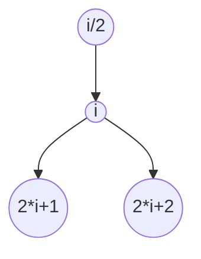

# 堆

## 1、定义：

一种完全二叉树，又叫优先队列，使用一维数组存储，有最大堆和最小堆两种；

最大堆：父节点均大于或等于左右子节点；

最小堆：父节点均小于或等于左右子节点。

性质：层次遍历是单调序，最大堆为降序，最小堆为升序

```mermaid
graph TB;
1((i/2))
2((i))
3((2*i+1))
4((2*i+2))
1-->2
2-->3
2-->4
```