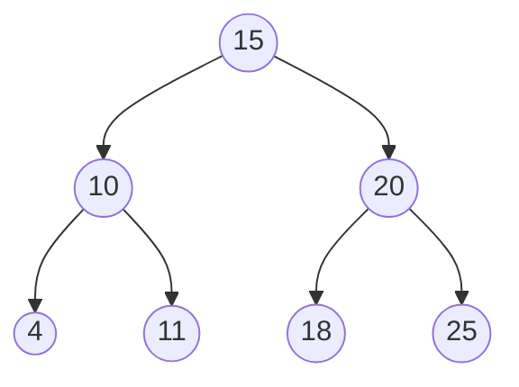

# 二叉树

## 1、二叉搜索树：

### 1）、定义：

* 定义：左子树每个节点的值都不大于父节点，右子树所有节点的值都不小于父节点。

* 别名：二叉查找树

* 特性：二叉树中序遍历节点为升序

* 最大值：最左子节点

* 最小值：最右子节点

### 2）、基本操作：

* 查找：

  与父节点比较：

  若相等，

* 插入：

* 

* 删除：

* 遍历：前序、中序、后序、层次(BFS)、DFS

