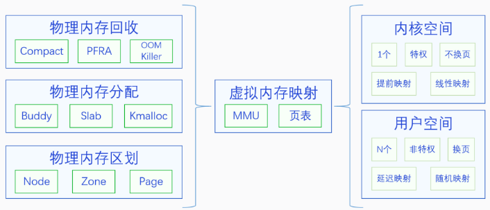

# 基本概念：                                                                                                                                                                                                                                                                                                                                                                                                                                                                                                                                                                                                   

## 1、Linux内存管理体系：



### 1）、物理内存区域划分：node -> zone -> page

- node：节点，一般NUMA架构的设备才有多个节点，常见UMA架构的设备只有一个节点，未开启CONFIG_NUMA，linux定义了一个唯一的node：

  ```c
  // linux中用struct pglist_data结构体描述内存节点：
  #ifndef CONFIG_NUMA
  struct pglist_data __refdata contig_page_data;
  EXPORT_SYMBOL(contig_page_data);
  #endif
  ```

- zone：区域，目前一个节点最多可以有6个区域，但并不都是必须的，可以没有；

  - ZONE_DMA：x86中物理内存前16M是DMA区域，因为早期ISA总线上DMA控制器只能访问16M物理内存；现代arm设备通常具有iommu，不需要ZONE_DMA；
  - ZONE_DMA32：对于64为系统，若物理内存超多4G，同时又有只能访问4G内存的DMA设备，需要设置ZONE_DMA32；对于32位设置，系统能访问的总内存只有4G，一般不需要单独划分ZONE_DMA32；
  - ZONE_NORMAL：常规内存，在节点中必须存在；
  - ZONE_HIGHMEM：高端内存，只有32位系统需要，由于32位系统内核空间只能直接访问896M的物理内存，超过的部门需要划分到高度内存做特殊处理；
  - ZONE_MOVABLE：可移动内存，用于可热插拔的内存，默认开启；
  - ZONE_DEVICE：设备内存，掉电后内部不消失的内存，一般的设备中没有这种内存；一些带内存的外设如GPU、加速卡等可以将自己的内存区域注册给linux内核；
  - 只有第一个node节点才有DAM、DMA32等，后续节点只有普通区域，如NORMAL、MOVABLE等；

  ```c
  // 节点类型定义：
  enum zone_type {
  #ifdef CONFIG_ZONE_DMA
  	ZONE_DMA,
  #endif
  #ifdef CONFIG_ZONE_DMA32
  	ZONE_DMA32,
  #endif
       ZONE_NORMAL,
  #ifdef CONFIG_HIGHMEM
  	ZONE_HIGHMEM,
  #endif
  	ZONE_MOVABLE,
  #ifdef CONFIG_ZONE_DEVICE
  	ZONE_DEVICE,
  #endif
  	__MAX_NR_ZONES
  };
  // 节点描述结构体：
  struct zone {
      strcut free_area free_area[NR_PAGE_ORDERS]; //不同阶数的空闲物理页块列表，最多11阶
  }
  ```

- page：页，常见大小为4K，物理页通常叫**页帧**，页帧编号为pfn：page frame number，从0地址开始编号，pfn乘以页大小就是物理地址；

  ```c
  // 根据物理地址计算页帧号：
  #define PFN_PHYS(x) ((phys_addr_t)(x) << PAGE_SHIFT)
  // 根据页帧号计算物理地址：
  #define PHYS_PFN(x) ((unsigned long)((x) >> PAGE_SHIFT))
  // 页帧描述结构体：
  struct page {}
  ```
  

### 2）、物理内存模型：

- 平坦内存模型：Flat Memory，物理内存连续，没有空洞；

- 离散内存模型：Discontiguous Memory，物理内存有空洞或支持内存热插拔，如NUMA架构；最新应已被移除内核；

- 稀疏内存模型：Sparse Memory，可同时处理平坦内存、稀疏内存、极度稀疏内存等，x86、arm64等将其作为默认内存模型；

  ```c
  // 内核中有一个页面描述符数组，用于描述系统中的所有页帧
  // 平坦内存中为：mem_map
  struct page *mem_map;
  // 稀疏内存中为：vmemmap
  #define vmemmap ((struct page *)VMEMMAP_START)
  ```

### 3）、物理内存分配：

- buddy：伙伴系统管理内核完成初步初始化之后未使用的内存，开始尝试以10阶大小加入伙伴系统，逐步减小，直到以0阶将所有内存加入；

  ```c
  // 管理结构体，系统定义大小为11的strcut free_area数组，因为最大阶数为10：
  struct free_area {
   struct list_head free_list[MIGRATE_TYPES];
   unsigned long  nr_free;
  };
  //buddy初始化：
  start_kernel() -> mm_init() -> page_alloc_init_late()
  ```

  - 释放内存给buddy系统时，会先尝试进行合并，合并后再存入伙伴系统；合并时不能随意和前后一个空闲的相同阶数的内存区域合并，必须符合对其要求，

- slab：先从伙伴系统中分配一些页，再切分成同样大小的基本块，用户再从slab中申请同样大小的内存块，如struct task_struct；当前外部接口都为slab，但内部实现有3种，分别是slab、slub、slob：

  - slub：针对内存较大的系统做了优化，目前除了嵌入式系统，默认使用slub实现；
  - slab：旧系统中使用较多，复杂度较高；
  - slob：针对嵌入式系统做了优化；

  ```c
  //slab分配器接口：
  struct kmem_cache *kmem_cache_create(const char *name, unsigned int size,
     unsigned int align, slab_flags_t flags,
     void (*ctor)(void *));
  void kmem_cache_destroy(struct kmem_cache *);
  void *kmem_cache_alloc(struct kmem_cache *, gfp_t flags);
  void kmem_cache_free(struct kmem_cache *, void *);
  ```

- kmalloc：用于分配偶发的内存碎片，基于slab机制，系统启动时kmalloc会预先创建一些不同大小的slab，供用户申请；

- vmalloc：分配物理地址可能不连续的内存；

### 4）、物理内存回收：

- 回收时机：

  - 同步回收：在分配内存时，发现内存不足，则立即进行内存回收；
    - 其中一个机制时OOM killer，内存耗尽时会终止部分进程，以实现内存回收；

  - 异步回收：创建专门的线程定期检测，如果发现内存不足，则进行内存回收；
    - 每个内存节点有一个内存规则线程：kcompactd/\<nodeid\>；
    - 每个内存节点有一个页帧回收线程：kspawd/\<nodeid\>；

- 回收类型：

  - 内存规整(碎片整理)：增加连续可用内存量；
  - 页帧回收：将物理页帧写入外存，并解除内存映射；
