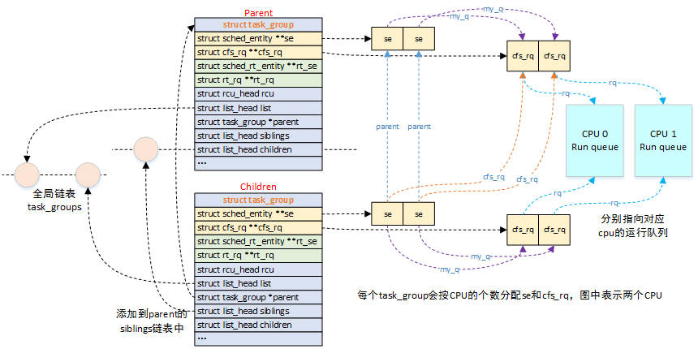

# 1、调度的时机

tick中断中；

中断返回时；

阻塞操作：semaphore、mutex、等待队列等；

# 2、进程状态

```bash
R：TASK_RUNNING，可执行
S：TASK_INTERRUPTIBLE，可中断睡眠状态，进程在等待事件，事件发生时会被唤醒，如socket、锁、信号量等
D：TASK_UNINTERRUPTIBLE，不可中断睡眠状态，进程不响应异步信号，如kill -9
I：IDLE，空闲状态，不可中断睡眠状态的内核线程
T：TASK_STOPPED or TASK_TRACED，暂停或跟踪
    SIGSTOP可是进程进入TASK_STOPPED状态，SIGCONT恢复；进程被跟踪时处于TASK_TRACED状态
Z：TASK_DEAD - EXIT_ZOMBIE，退出状态，成为僵尸进程
X：TASK_DEAD - EXIT_DEAD，退出状态，进程即将被销毁
```

# 3、调度信息：

- 信息获取：cat /proc/sched_debug
- 对应源码：kernel/sched/debug.c

```bash
cpu#0
  .nr_running                    : 18                           # 可运行任务数量
  .nr_switches                   : 143056637                    # 累积切换次数
  .nr_uninterruptible            : 58476                        #
  .next_balance                  : 4299.147278                  # 
  .curr->pid                     : 388473                       # 正在运行的任务pid
  .clock                         : 17021141.835360              #
  .clock_task                    : 12681871.696416              #
  .avg_idle                      : 21556                        #
  .max_idle_balance_cost         : 500000                       #

cfs_rq[0]:/user.slice
  .exec_clock                    : 0.000000                      # 累积运行时间
  .MIN_vruntime                  : 0.000001                      # 虚拟时间最小的进程的vtime
  .min_vruntime                  : 25202.055937                  # 当前rq vtime下限
  .max_vruntime                  : 0.000001
  .spread                        : 0.000000
  .spread0                       : -1276551.769151
  .nr_spread_over                : 0
  .nr_running                    : 0                             # 处于就绪队列数量
  .load                          : 0
  .load_avg                      : 1
  .runnable_avg                  : 1
  .util_avg                      : 1
  .util_est_enqueued             : 0
  .removed.load_avg              : 0
  .removed.util_avg              : 0
  .removed.runnable_avg          : 0
  .tg_load_avg_contrib           : 1
  .tg_load_avg                   : 1436
  .throttled                     : 0
  .throttle_count                : 0
  .se->exec_start                : 12681871.375232
  .se->vruntime                  : 1301741.993482
  .se->sum_exec_runtime          : 8884.429856
  .se->load.weight               : 730
  .se->avg.load_avg              : 0
  .se->avg.util_avg              : 1
  .se->avg.runnable_avg          : 1
```

# 4、优先级：

- 线程优先级范围：0~139，值越小，优先级越高；
- 用户态线程优先级范围：100~139，默认优先级是120，对应nice值为0；
- nice值范围：-20\~19，对应优先级100~139；
- 优先级为0-99的线程是实时线程，为100-139的线程是非实时线程；
- 系统中存在实时进程时，优先执行实时进程；直到实时进程结束或者主动让出CPU，才会调度非实时进程。
- SCHED_NORMAL调度策略为CFS，为默认调度策略，完全公平调度，没有优先级的概念；
- SCHED_FIFO、SCHED_RR为实时调度策略，优先级范围为1~99；

# 5、CFS：

- 每个cpu对应一个rq，每个rq对应一个cfs_rq，cfs_rq处理的单元是sched_entity，sched_entiy位于每个task_struct中；

```c
struct task_struct {
	struct sched_entity	se;
};

struct task_struct *p = container_of(se, struct taks_struct, se);
```

- 调度发生时，调度器从cfs_rq中选择vruntime最小的task运行；
- 若调度器选择了一个任务组，则继续从改调度组中选择vruntime最新的task；

```c
struct cfs_rq {
        struct load_weight      load;
        unsigned int            nr_running;
        unsigned int            h_nr_running;      /* SCHED_{NORMAL,BATCH,IDLE} */
        unsigned int            idle_h_nr_running; /* SCHED_IDLE */

        u64                     exec_clock;
        u64                     min_vruntime;
#ifndef CONFIG_64BIT
        u64                     min_vruntime_copy;
#endif

        struct rb_root_cached   tasks_timeline;

        /*
         * 'curr' points to currently running entity on this cfs_rq.
         * It is set to NULL otherwise (i.e when none are currently running).
         */
        struct sched_entity     *curr;
        struct sched_entity     *next;
        struct sched_entity     *last;
        struct sched_entity     *skip;

#ifdef  CONFIG_SCHED_DEBUG
        unsigned int            nr_spread_over;
#endif

#ifdef CONFIG_SMP
        /*
         * CFS load tracking
         */
        struct sched_avg        avg;
#ifndef CONFIG_64BIT
        u64                     load_last_update_time_copy;
#endif
        struct {
                raw_spinlock_t  lock ____cacheline_aligned;
                int             nr;
                unsigned long   load_avg;
                unsigned long   util_avg;
                unsigned long   runnable_avg;
        } removed;

#ifdef CONFIG_FAIR_GROUP_SCHED
        unsigned long           tg_load_avg_contrib;
        long                    propagate;
        long                    prop_runnable_sum;

        /*
         *   h_load = weight * f(tg)
         *
         * Where f(tg) is the recursive weight fraction assigned to
         * this group.
         */
        unsigned long           h_load;
        u64                     last_h_load_update;
        struct sched_entity     *h_load_next;
#endif /* CONFIG_FAIR_GROUP_SCHED */
#endif /* CONFIG_SMP */

#ifdef CONFIG_FAIR_GROUP_SCHED
        struct rq               *rq;    /* CPU runqueue to which this cfs_rq is attached */

        /*
         * leaf cfs_rqs are those that hold tasks (lowest schedulable entity in
         * a hierarchy). Non-leaf lrqs hold other higher schedulable entities
         * (like users, containers etc.)
         *
         * leaf_cfs_rq_list ties together list of leaf cfs_rq's in a CPU.
         * This list is used during load balance.
         */
        int                     on_list;
        struct list_head        leaf_cfs_rq_list;
        struct task_group       *tg;    /* group that "owns" this runqueue */

#ifdef CONFIG_CFS_BANDWIDTH
        int                     runtime_enabled;
        s64                     runtime_remaining;

        u64                     throttled_clock;
        u64                     throttled_clock_pelt;
        u64                     throttled_clock_pelt_time;
        int                     throttled;
        int                     throttle_count;
        struct list_head        throttled_list;
#endif /* CONFIG_CFS_BANDWIDTH */
#endif /* CONFIG_FAIR_GROUP_SCHED */
};
```

# 6、sched_entity：

```c
/* file: include/linux/sched.h */
struct sched_entity {
	/* For load-balancing: */
	/* 权重，权重由进程的 nice 值进行计算 */
	struct load_weight load;
	/* 红黑树节点 */
	struct rb_node run_node;
	struct list_head group_node;
	/* 是否在 runqueue 上，1 则表示在 rq 中 */
	unsigned int on_rq;

	/* 记录该进程在 CPU 上开始执行的时间 */
	u64 exec_start;
	/* 记录总运行时间 */
	u64 sum_exec_runtime;
	/* 该进程的虚拟运行时间，该值是红黑树中的key, CFS 依据该值来保证公平调度 */
	u64 vruntime;
	/* 截止该调度周期开始时，进程的总运行时间，在check_preempt_tick中会使用到 */
	u64 prev_sum_exec_runtime;

	/* scheduler 做负载均衡时，对该进程的迁移次数 */
	u64 nr_migrations;

	/* 统计数据 */
	struct sched_statistics statistics;

#ifdef CONFIG_FAIR_GROUP_SCHED
	int depth;
	/* parent 如果非空的话，那么一定指向一个代表 task_group 的 sched_entity, 即my_q 非空 */
	struct sched_entity *parent;
	/* rq on which this entity is (to be) queued: */
	struct cfs_rq *cfs_rq;
	/* rq "owned" by this entity/group: */
	/*
	 * 用来判断该 se 是否是一个 task, 如果 my_q 为null, 则是task, 否则则表示是一个
	 * task_group 参考宏 entity_is_task
	 */
	struct cfs_rq *my_q;
	/* cached value of my_q->h_nr_running */
	unsigned long runnable_weight;
#endif

#ifdef CONFIG_SMP
	/*
	 * Per entity load average tracking.
	 *
	 * Put into separate cache line so it does not
	 * collide with read-mostly values above.
	 */
	struct sched_avg avg;
#endif
};
```


# 7、struct task_group：

```c
struct task_group {
        struct cgroup_subsys_state css;

#ifdef CONFIG_FAIR_GROUP_SCHED
        /* schedulable entities of this group on each CPU */
        struct sched_entity     **se;
        /* runqueue "owned" by this group on each CPU */
        struct cfs_rq           **cfs_rq;
        unsigned long           shares;

#ifdef  CONFIG_SMP
        /*
         * load_avg can be heavily contended at clock tick time, so put
         * it in its own cacheline separated from the fields above which
         * will also be accessed at each tick.
         */
        atomic_long_t           load_avg ____cacheline_aligned;
#endif
#endif

#ifdef CONFIG_RT_GROUP_SCHED
        struct sched_rt_entity  **rt_se;
        struct rt_rq            **rt_rq;

        struct rt_bandwidth     rt_bandwidth;
#endif

        struct rcu_head         rcu;
        struct list_head        list;

        struct task_group       *parent;
        struct list_head        siblings;
        struct list_head        children;

#ifdef CONFIG_SCHED_AUTOGROUP
        struct autogroup        *autogroup;
#endif

        struct cfs_bandwidth    cfs_bandwidth;

#ifdef CONFIG_UCLAMP_TASK_GROUP
        /* The two decimal precision [%] value requested from user-space */
        unsigned int            uclamp_pct[UCLAMP_CNT];
        /* Clamp values requested for a task group */
        struct uclamp_se        uclamp_req[UCLAMP_CNT];
        /* Effective clamp values used for a task group */
        struct uclamp_se        uclamp[UCLAMP_CNT];
#endif
};
```



# 8、sched_rt_entity：

```c
struct sched_rt_entity {
        struct list_head                run_list;           //用于挂载rt_rq的优先级队上的链表节点
        unsigned long                   timeout;            //调度超时时间
        unsigned long                   watchdog_stamp;     //记录jiffies值
        unsigned int                    time_slice;         //时间片
        unsigned short                  on_rq;              //是否处于rt_rq中
        unsigned short                  on_list;            //是否添加到rt_rq的优先级队列中并更新bitmap

        struct sched_rt_entity          *back;
#ifdef CONFIG_RT_GROUP_SCHED                                //rt组调度
        struct sched_rt_entity          *parent;
        /* rq on which this entity is (to be) queued: */
        struct rt_rq                    *rt_rq;
        /* rq "owned" by this entity/group: */
        struct rt_rq                    *my_q;
#endif
} __randomize_layout;
```

# 9、调度起点：

- ttwu：try to wake up，尝试唤醒
- 触发调度的时刻：
  - 分为触发和执行两部分，触发为在当前进程thread_info->flags中设置TIF_NEED_RESCHED标志，执行时通过schedule()函数完成进程选择和切换；
  - TIF_NEED_RESCHED标志：被设置的任务可抢占当前正在运行的任务；
  - 设置TIF_NEED_RESCHED标志时机：
    - tick中断中进行周期性检查时调用schedule_tick()；
    - 被wake_up()唤醒进程比正在运行的进程优先级高时，会抢占当前进程；
- 执行schedule()的时机：
  - 系统调用结束或中断返回时；
  - 进程由于需要睡眠等主动调用schedule()；
- 系统调用yield、pause也会触发调度；

```c
set_tsk_need_resched()

asmlinkage __visible void __sched schedule(void)
    __schedule();
	    pick_next_task();
    		for_each_class(class);
    			p = class->pick_next_task(rq);

/*
 * 周期调度器：每个cpu的tick中断会调用
 */
void scheduler_tick(void);
    curr->sched_class->task_tick(rq, curr, 0);  //调度类的task_tick回调

wake_up_process(p);
    try_to_wake_up(p, TASK_NORMAL, 0);
    	ttwu_do_activate();
		    ttwu_runnable()/ttwu_queue();  //task_on_rq_queued()
				ttwu_do_wakeup();
				    p->sched_class->task_woken(rq, p);
						task_woken_rt(rq, p);
			        	    push_rt_tasks(rq);
								push_rt_task(rq, false);
									pick_next_pushable_task();
									activate_task();
				                	    enqueue_task();

schedule(void);
	__schedule(false, false);
		pick_next_task(rq, prev, rf);  //prev: curr task on cpu
			put_prev_task(rq, p);  //only cfs
			put_prev_task_balanc(); -> put_prev_task(rq, p);  //all sched class
				prev->sched_class->put_prev_task(rq, prev);
					put_prev_task_rt(rq, p);
						enqueue_pushable_task();
							plist_add(&p->pushable_tasks, &rq->rt.pushable_tasks);
```

## 1）、系统调用返回时触发调度：

```c
ret_to_user  //arch/arm64/kernel/entry.S
    do_notify_resume();  //arch/arm64/kernel/signal.c
    	schedule();
```

# 10 struct rt_rq：

```c
struct rt_rq {
        struct rt_prio_array    active;
        unsigned int            rt_nr_running;
        unsigned int            rr_nr_running;
#if defined CONFIG_SMP || defined CONFIG_RT_GROUP_SCHED
        struct {
                int             curr; /* highest queued rt task prio */
#ifdef CONFIG_SMP
                int             next; /* next highest */
#endif
        } highest_prio;
#endif
#ifdef CONFIG_SMP
        unsigned long           rt_nr_migratory;
        unsigned long           rt_nr_total;
        int                     overloaded;
        struct plist_head       pushable_tasks;

#endif /* CONFIG_SMP */
        int                     rt_queued;

        int                     rt_throttled;
        u64                     rt_time;
        u64                     rt_runtime;
        /* Nests inside the rq lock: */
        raw_spinlock_t          rt_runtime_lock;

#ifdef CONFIG_RT_GROUP_SCHED
        unsigned long           rt_nr_boosted;

        struct rq               *rq;
        struct task_group       *tg;
};
```

## 1）、task进入rt_rq：

```c
enqueue_task()  //kernel/sched/core.c
    p->sched_class->enqueue_task(rq, p, flags);
		enqueue_task_rt()  //kernel/sched/rt.c
```

