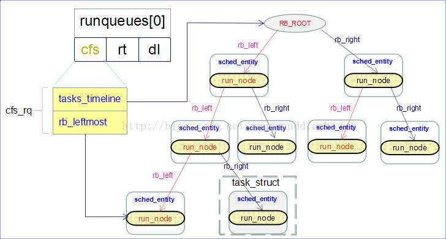

# 1、调度的时机

tick中断中；

中断返回时；

阻塞操作：semaphore、mutex、等待队列等；

# 2、进程状态

```bash
R：TASK_RUNNING，可执行
S：TASK_INTERRUPTIBLE，可中断睡眠状态，进程在等待事件，事件发生时会被唤醒，如socket、锁、信号量等
D：TASK_UNINTERRUPTIBLE，不可中断睡眠状态，进程不响应异步信号，如kill -9
I：IDLE，空闲状态，不可中断睡眠状态的内核线程
T：TASK_STOPPED or TASK_TRACED，暂停或跟踪
    SIGSTOP可是进程进入TASK_STOPPED状态，SIGCONT恢复；进程被跟踪时处于TASK_TRACED状态
Z：TASK_DEAD - EXIT_ZOMBIE，退出状态，成为僵尸进程
X：TASK_DEAD - EXIT_DEAD，退出状态，进程即将被销毁
```

# 3、调度信息：

- 信息获取：cat /proc/sched_debug
- 对应源码：kernel/sched/debug.c

```bash
cpu#0
  .nr_running                    : 18                           # 可运行任务数量
  .nr_switches                   : 143056637                    # 累积切换次数
  .nr_uninterruptible            : 58476                        #
  .next_balance                  : 4299.147278                  # 
  .curr->pid                     : 388473                       # 正在运行的任务pid
  .clock                         : 17021141.835360              #
  .clock_task                    : 12681871.696416              #
  .avg_idle                      : 21556                        #
  .max_idle_balance_cost         : 500000                       #

cfs_rq[0]:/user.slice
  .exec_clock                    : 0.000000                      # 累积运行时间
  .MIN_vruntime                  : 0.000001                      # 虚拟时间最小的进程的vtime
  .min_vruntime                  : 25202.055937                  # 当前rq vtime下限
  .max_vruntime                  : 0.000001
  .spread                        : 0.000000
  .spread0                       : -1276551.769151
  .nr_spread_over                : 0
  .nr_running                    : 0                             # 处于就绪队列数量
  .load                          : 0
  .load_avg                      : 1
  .runnable_avg                  : 1
  .util_avg                      : 1
  .util_est_enqueued             : 0
  .removed.load_avg              : 0
  .removed.util_avg              : 0
  .removed.runnable_avg          : 0
  .tg_load_avg_contrib           : 1
  .tg_load_avg                   : 1436
  .throttled                     : 0
  .throttle_count                : 0
  .se->exec_start                : 12681871.375232
  .se->vruntime                  : 1301741.993482
  .se->sum_exec_runtime          : 8884.429856
  .se->load.weight               : 730
  .se->avg.load_avg              : 0
  .se->avg.util_avg              : 1
  .se->avg.runnable_avg          : 1
```

# 4、优先级：

- 线程优先级范围：0~139，值越小，优先级越高；
- 用户态线程优先级范围：100~139，默认优先级是120，对应nice值为0；
- nice值范围：-20\~19，对应优先级100~139；
- 优先级为0-99的线程是实时线程，为100-139的线程是非实时线程；
- 系统中存在实时进程时，优先执行实时进程；直到实时进程结束或者主动让出CPU，才会调度非实时进程。
- SCHED_NORMAL调度策略为CFS，为默认调度策略，完全公平调度，没有优先级的概念；
- SCHED_FIFO、SCHED_RR为实时调度策略，优先级范围为1~99；

# 5、CFS：

- 每个cpu对应一个rq，每个rq对应一个cfs_rq，cfs_rq处理的单元是sched_entity，sched_entiy位于每个task_struct中；

```c
struct task_struct {
	struct sched_entity	se;
};

struct task_struct *p = container_of(se, struct taks_struct, se);
```

- 调度发生时，调度器从cfs_rq中选择vruntime最小的task运行；
- 若调度器选择了一个任务组，则继续从改调度组中选择vruntime最新的task；

# 6、sched_entity：

```c
/* file: include/linux/sched.h */
struct sched_entity {
	/* For load-balancing: */
	/* 权重，权重由进程的 nice 值进行计算 */
	struct load_weight load;
	/* 红黑树节点 */
	struct rb_node run_node;
	struct list_head group_node;
	/* 是否在 runqueue 上，1 则表示在 rq 中 */
	unsigned int on_rq;

	/* 记录该进程在 CPU 上开始执行的时间 */
	u64 exec_start;
	/* 记录总运行时间 */
	u64 sum_exec_runtime;
	/* 该进程的虚拟运行时间，该值是红黑树中的key, CFS 依据该值来保证公平调度 */
	u64 vruntime;
	/* 截止该调度周期开始时，进程的总运行时间，在check_preempt_tick中会使用到 */
	u64 prev_sum_exec_runtime;

	/* scheduler 做负载均衡时，对该进程的迁移次数 */
	u64 nr_migrations;

	/* 统计数据 */
	struct sched_statistics statistics;

#ifdef CONFIG_FAIR_GROUP_SCHED
	int depth;
	/* parent 如果非空的话，那么一定指向一个代表 task_group 的 sched_entity, 即my_q 非空 */
	struct sched_entity *parent;
	/* rq on which this entity is (to be) queued: */
	struct cfs_rq *cfs_rq;
	/* rq "owned" by this entity/group: */
	/*
	 * 用来判断该 se 是否是一个 task, 如果 my_q 为null, 则是task, 否则则表示是一个
	 * task_group 参考宏 entity_is_task
	 */
	struct cfs_rq *my_q;
	/* cached value of my_q->h_nr_running */
	unsigned long runnable_weight;
#endif

#ifdef CONFIG_SMP
	/*
	 * Per entity load average tracking.
	 *
	 * Put into separate cache line so it does not
	 * collide with read-mostly values above.
	 */
	struct sched_avg avg;
#endif
};
```


