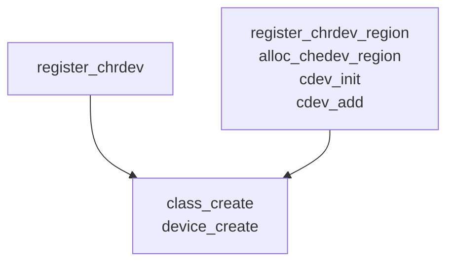
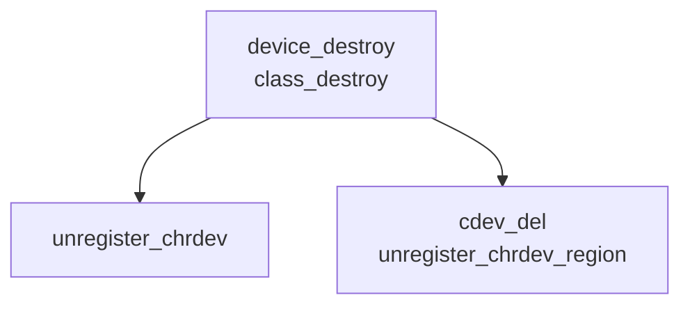

## 1、字符设备创建销毁：

### 1)、字符设备创建：

* 1.1)、注册字符设备：
1）、当major不为0时，注册并返回0；
2）、当major为0时，动态申请主设备号，并返回major；
3）、失败时返回错误码。
```c
int register_chrdev(unsigned int major,const char* name,struct file_operations *fops)
```

* 1.2）、或：注册或申请设备号，创建字符设备：
```c
int register_chrdev_region(dev_t from, unsigned count, const char *name)
int alloc_chrdev_region(dev_t *dev, unsigned baseminor, unsigned count,
						const char *name)
void cdev_init(struct cdev *cdev, const struct file_operations *fops)
int cdev_add(struct cdev *p, dev_t dev, unsigned count)
```

* 1.3）、创建驱动类，放在sysfs下，udev将根据sysfs下的类，自动创建dev下设备节点：
```c
struct class *class_create(struct module *owner, const char *name)
struct device *device_create(struct class *class, struct device *parent, dev_t devt,
							 void *drvdata, const char *fmt, ...)
```

### 2）、字符设备卸载：



* 2.1）、销毁设备节点与驱动类：
```c
void device_destroy(struct class *dev, dev_t devt)
void class_destroy(struct class * cls);
```
* 2.2）、注销字符设备：
```c
static inline void unregister_chrdev(unsigned int major, const char *name)
{
	__unregister_chrdev(major, 0, 256, name);
}

void __unregister_chrdev(unsigned int major, unsigned int baseminor, unsigned int count,
						 const char * name)
```

* 2.3）、或：删除字符设备并注销设备号：
```c
void cdev_del(struct cdev *p)
void unregister_chrdev_region(dev_t from, unsigned count)
```

### 3）、设备号操作：
```c
#define MAJOR(dev)		((unsigned int) ((dev) >> MINORBITS))	//获取主设备号
#define MINOR(dev)		((unsigned int) ((dev) & MINORMASK))	//获取次设备号
#define MKDEV(ma,mi)            (((ma) << MINORBITS) | (mi))		//合成设备号
```

### 4）、file_operations结构体：
```c
struct file_operations {
	struct module *owner;
	loff_t (*llseek) (struct file *, loff_t, int);
	ssize_t (*read) (struct file *, char __user *, size_t, loff_t *);
	ssize_t (*write) (struct file *, const char __user *, size_t, loff_t *);
	ssize_t (*read_iter) (struct kiocb *, struct iov_iter *);
	ssize_t (*write_iter) (struct kiocb *, struct iov_iter *);
	int (*iterate) (struct file *, struct dir_context *);
	int (*iterate_shared) (struct file *, struct dir_context *);
	__poll_t (*poll) (struct file *, struct poll_table_struct *);
	long (*unlocked_ioctl) (struct file *, unsigned int, unsigned long);
	long (*compat_ioctl) (struct file *, unsigned int, unsigned long);
	int (*mmap) (struct file *, struct vm_area_struct *);
	unsigned long mmap_supported_flags;
	int (*open) (struct inode *, struct file *);
	int (*flush) (struct file *, fl_owner_t id);
	int (*release) (struct inode *, struct file *);
	int (*fsync) (struct file *, loff_t, loff_t, int datasync);
	int (*fasync) (int, struct file *, int);
	int (*lock) (struct file *, int, struct file_lock *);
	ssize_t (*sendpage) (struct file *, struct page *, int, size_t, loff_t *, int);
	unsigned long (*get_unmapped_area)(struct file *, unsigned long, unsigned long,
										unsigned long, unsigned long);
	int (*check_flags)(int);
	int (*flock) (struct file *, int, struct file_lock *);
	ssize_t (*splice_write)(struct pipe_inode_info *, struct file *, loff_t *,
							size_t, unsigned int);
	ssize_t (*splice_read)(struct file *, loff_t *, struct pipe_inode_info *,
						 	size_t, unsigned int);
	int (*setlease)(struct file *, long, struct file_lock **, void **);
	long (*fallocate)(struct file *file, int mode, loff_t offset,
			  loff_t len);
	void (*show_fdinfo)(struct seq_file *m, struct file *f);
#ifndef CONFIG_MMU
	unsigned (*mmap_capabilities)(struct file *);
#endif
	ssize_t (*copy_file_range)(struct file *, loff_t, struct file *,
			loff_t, size_t, unsigned int);
	int (*clone_file_range)(struct file *, loff_t, struct file *, loff_t,
			u64);
	ssize_t (*dedupe_file_range)(struct file *, u64, u64, struct file *,
			u64);
} __randomize_layout;
```
* unlock_ioctl: 64位应用程序运行在64位主机，32位应用程序运行在32位主机 需调用
```c
long (*unlocked_ioctl) (struct file *, unsigned int, unsigned long);
```
* compat_ioctl: 32位应用程序运行在64位主机需调用
```c
long (*compat_ioctl) (struct file *, unsigned int, unsigned long);
```

## 2、platform虚拟总线注册设备：

### 2.1)、设备创建：
```c
int platform_device_register(struct platform_device *pdev)

#define platform_driver_register(drv) \
	__platform_driver_register(drv, THIS_MODULE)
int __platform_driver_register(struct platform_driver *drv, struct module *owner)
```
### 2.2）、设备删除：
```c
void platform_driver_unregister(struct platform_driver *drv)
void platform_device_unregister(struct platform_device *pdev)
```
### 2.3）、设备probe：
```c
struct platform_device
struct platform_driver
```
当在of_device_id中定义多个compatible字段时，若dts中有与之匹配的node节点，将多次进入platform_driver的probe函数。

## 3、读取dts信息：

### 3.1）、直接查找dts node：
```c
struct device_node *of_find_compatible_node(struct device_node *from,
	const char *type, const char *compatible)

eg: node = of_find_compatible_node(NULL, NULL, "compatible");
```

### 3.2）、在probe中获取node：
```c
struct platform_device pdev -> struct device dev -> struct device_node of_node

eg: node = pdev->dev->of_node;
```