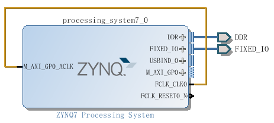
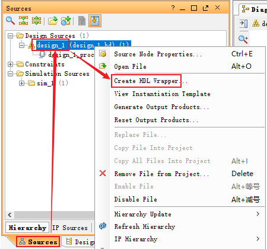
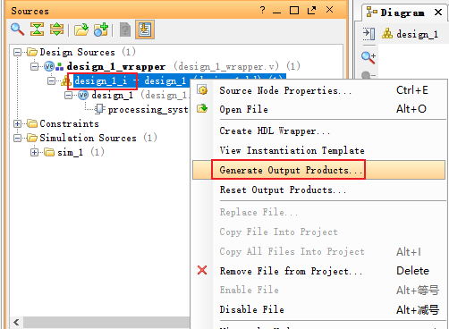

# vivado新建工程：

- vivado 2016.2

## 1、新建Vivado工程：

```bash
1. 启动页面：
	Quick Start: Create New Project
2. 向导：
	Next
3. Project Name：
	Project name: led
	Project location: D:/code/vivado/test02
	勾选 "Create project subdirectory"
	Next
4. Project Type：
	只选中 "RTL Project"
	Next
5. Add Sources:
	Next
6. Add Existing IP (optional)
	Next
7. Add Constraints (optional)
	Next
8. Default Part:
	Search: xc7z020clg400-2
	选中 "xc7z020clg400-2"
	Next
9. New Project Summary:
	Finish
```

## 2、初始化PS外设：

```bash
1. 创建模块：
	Project Manager -> IP Intergrator -> Create Block Design
2. Create Block Design:
	Design name: design_1
	OK
3. 添加IP：
	在design_1页面空白出右击 -> Add IP...
	或：点击design_1页面左侧的Add IP图标，鼠标悬停在图标上时有提示
4. Search：
	搜索："ZYNQ7 Processing System"
	双击条目添加
5. 打开PS配置向导：
	双击design_1页面中出现的ZYNQ模块
6. Peripheral I/O Pins：  # 在此页面配PS外设引脚
	UART1: MIO48~MIO49
	Quad SPI Flash: MIO1~MIO6
		选中："Single SS 4bit IO"
	Ethernet 0: MIO16~MIO27
		MDIO: MIO52~MIO53
	USB0: MIO28~MIO39
	SD 0: MIO40~MIO45
		Card Detect: MIO47
	GPIO MI0: 勾选后剩余引脚默认作为GPIO
		USB PHY Reset: MIO46
7. MIO Configuration:
	Bank 0 I/O Voltage: LVCMOS 3.3V
	Bank 1 I/O Voltage: LVCMOS 1.8V
	I/O Peripherals
		ENET 0: MIO16~MIO27, IO Type全改为"HSTL 1.8V", Speed全改为"fast"
8. Clock Configuration:
	保持默认，不用修改
9. DDR Configuration:
	DDR Controller Configuration:
		Memory Part: MT41J256M16 RE-125
10. 至此完成所有配置：
	OK
11. 点击："Run Block Automation" -> OK
12. 将 FCLK_CLK0 连接到 M_AXI_GPO_ACLK:
```



```bash
13. 在Sources窗口"design_1"上右键 -> 选择"Create HDL Wrapper..." -> OK
```



```bash
14. 展开"design_1_wrapper" -> 在"design_1_i"上右键 -> 选择"Generate Output Products..." -> Generate
```



```bash
15. 导出hdf文件：
	File -> Export -> Export Hardware... -> OK  # 生成的hdf为：led/led.sdk/design_1_wrapper.hdf
```

